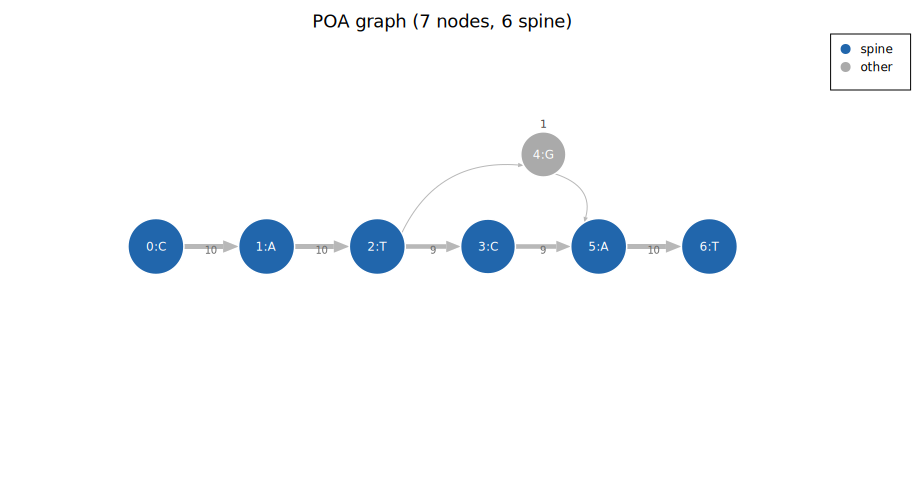
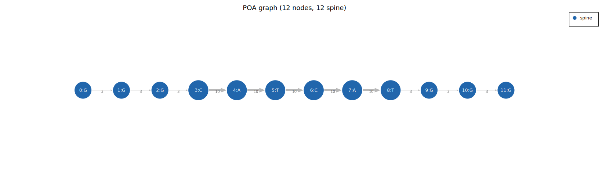
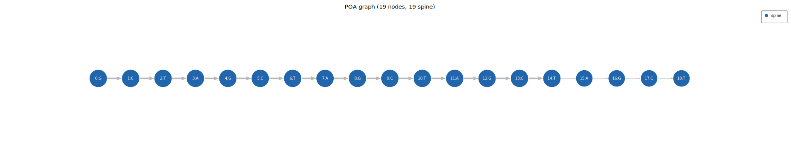
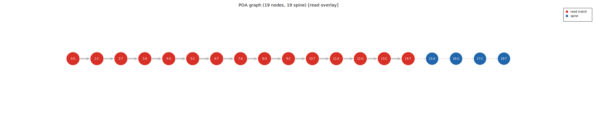

# Consensus Extraction

## Heaviest-path DP

The heaviest path is found by a DP over the topologically sorted graph. At each node, the
score is the maximum over all predecessors of:

```
score[node] = max over predecessors p of:
    score[p] + (edge_weight(p, node) - 1)
```

The `(weight - 1)` normalisation is load-bearing. Without it, a single outlier read that
inserts extra trailing bases produces a positive-scoring path to those bases, so the
consensus always extends to the outlier. With normalisation, only edges supported by two or
more reads score positively; single-read branches score -1 and are naturally avoided.

The traceback from the highest-scoring terminal node gives the sequence.

## Coverage filter

After extracting the heaviest path, nodes below a minimum coverage threshold are removed.
The threshold is:

```
min_cov = ceil(n_reads * min_coverage_fraction)
```

`min_coverage_fraction` defaults to 0.5 (strict majority). A node with coverage below
`min_cov` is not included in the consensus.

This filter is applied in two phases:

1. **Boundary trim**: remove leading and trailing low-coverage nodes from the path ends.
   This handles partial reads that do not span the full locus: they contribute to the middle
   of the graph but not the boundaries, leaving boundary nodes with seed-only coverage.
2. **Interior filtering**: remove minority detour chains in the interior. A chain of nodes
   with coverage below `min_cov` that is connected to higher-coverage nodes on both sides
   is a noise branch and is excluded.

## Example: heaviest path with edge weight labels

In this fixture, 9 reads are `CATCAT` and 1 read has a G at position 3 (`CATGAT`). The
graph has a single-node arm (G) off the spine. Edge labels show the read count on each
edge: spine edges carry weight 9-10, the arm edges carry weight 1.

After `(weight - 1)` normalisation, the spine edges score 8-9 per edge and the arm edges
score 0. The heaviest path naturally follows the spine, ignoring the single-read arm.



## Example: boundary trim with edge weight labels

Here, 3 reads span the full sequence `GGGCATCATGGG` (12 bp) and 7 reads cover only the
interior `CATCAT` (6 bp). With semi-global alignment (the default), the short reads take
free terminal gaps rather than forced deletions, so the GGG flank nodes accumulate
coverage only from the 3 spanning reads.

Edge labels show the read count: interior edges carry weight 10 (all reads), while the
flank edges carry weight 3. With min_cov = ceil(10 × 0.5) = 5, the flank nodes (weight 3)
fall below the threshold and boundary trim removes them. The consensus is `CATCAT`.



## Example: deletion graph

In this fixture, 10 reads have the full 19-base sequence and 3 reads have a 2-base
deletion at the end. The heaviest path follows the 10-read spine (blue). The 3 deletion
reads traverse a skip edge (arc above the spine) from position 13 to the end, adding edge
weight but not coverage to the skipped nodes.



With a deletion read overlaid (orange), you can see which nodes the deleting read traverses
(skipping positions 15-16 via the arc edge):



## Majority-frequency mode

As an alternative to heaviest path, `ConsensusMode::MajorityFrequency` converts the graph to
a column-aligned MSA and takes the plurality base at each column. The denominator at each
position is `coverage + delete_count` (reads on other bubble arms do not vote).

MF mode is more robust to the phase-shift boundary trim bug because it counts delete
traversals explicitly rather than relying on edge weights. It is better suited to HiFi data
where read lengths within an allele group are nearly identical.

## Semi-global alignment and boundary trim

With `AlignmentMode::SemiGlobal` (the default), partial reads take free terminal gaps rather
than forced delete traversals. This means that a read that does not span the full locus
does not generate delete ops at the boundary nodes, leaving those nodes with genuinely low
`coverage`. Boundary trim then correctly removes them.

With `AlignmentMode::Global`, partial reads are forced to traverse boundary nodes via deletes.
This does not increment `coverage` (by design), but it does keep the traversal path active
in the edge weights. Boundary trim still fires, but the alignment of partial reads in global
mode has a subtle failure: at homopolymer-flanked loci, shorter reads place their deletions
inside the homopolymer run rather than at the start. The extra node at the run boundary sits
on the only spine path with no shortcut alternative, so boundary trim cannot reach it. The
result is a consensus that takes the minority-depth path for those leading bases.

**Use `SemiGlobal` for extracted STR reads. It is the default.**

## Output: `Consensus`

```rust
pub struct Consensus {
    pub sequence:     Vec<u8>,
    pub coverage:     Vec<u32>,      // per-position read depth on the consensus path
    pub path_weights: Vec<i32>,      // incoming edge weight per base
    pub n_reads:      usize,
    pub graph_stats:  GraphStats,
    pub gaps:         Vec<CoverageGap>,
    pub bubble_sites: Vec<BubbleSite>,
    pub read_indices: Vec<usize>,    // populated by consensus_multi; empty otherwise
}
```

`coverage` and `path_weights` together describe confidence: a position where many reads
agreed (`path_weights` high) and coverage is at full depth is reliable. A position where
coverage drops (e.g. at a gap) is suspect.

## GraphStats

`GraphStats` is computed in a single O(V + E) pass after the graph is built. Key fields:

| Field | Meaning |
|---|---|
| `bubble_count` | Number of heterozygous nodes (2+ successors above `min_allele_freq`) |
| `max_bubble_depth` | Read count on the strongest minority arm |
| `longest_bubble_span` | Longest structural bubble in bases |
| `coverage_mean` / `coverage_variance` | Node coverage distribution |
| `edge_weight_gini` | Inequality of read support (0 = equal, 1 = one path dominates) |
| `single_support_fraction` | Fraction of nodes with coverage == 1 (noise level) |
| `median_input_read_len` | Median read length; used by the truncation detector |
