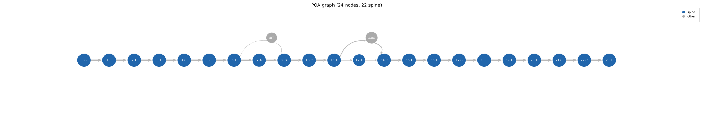
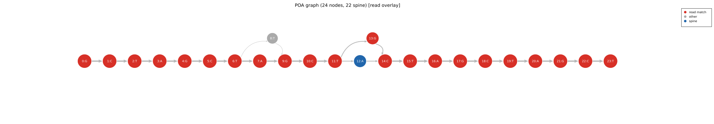

# Graph Construction

## Seeding

The engine builds an initial linear chain from a seed read: one node per base, with each
node connected to the next by an edge of weight 1 and coverage 1. This chain is the starting
backbone; every subsequent read is aligned into it.

The choice of seed matters, so `consensus()` self-seeds on the median-length read internally
rather than trusting the caller's index. A seed that is much longer or shorter than the read
set creates unnecessary early branches and inflates the band width the aligner needs to track
them; a median-length spanning read avoids that (see [Seed Selection](../library/seed-selection.md)).

## Adding a read

Each subsequent read is folded into the graph in three steps:

### 1. Topological sort (Kahn's algorithm)

The graph is sorted into a linear ordering where every node appears before all nodes it has
an outgoing edge to. This is required by the DP: the aligner processes nodes in topological
order so that all predecessors of a node have been scored before the node itself is scored.

The sort runs in O(V + E) and is cached between reads via the **stale spine** mechanism
described in [Banded DP Alignment](banded-dp.md).

### 2. DP alignment

The read is aligned against the sorted graph using banded affine-gap DP. The alignment
returns a sequence of operations: match (to a node), insert (a base), or delete (skip a node).

### 3. Graph update

The traceback is replayed to update the graph:

| Op | Action |
|---|---|
| Match | Increment the node's `coverage` and the incoming edge weight |
| Insert | Create a new node; connect it to the previous and next nodes in the traceback |
| Delete | Increment the skipped node's `delete_count` only; record the reconnection as a bypass edge around the skipped run |

**Insert nodes** are allocated with coverage 1 (the current read is the first to traverse
them). Subsequent reads that match the same insert base will merge into the existing node
rather than creating a new one, because the DP naturally finds the highest-scoring path and
a match to an existing node scores positively while opening a fresh insert pays the gap
penalty.

**Deletes** touch the skipped node only through its `delete_count`; the read's path is
reconnected by a separate bypass edge around the skipped run. A deleted node therefore gains
no `coverage` and no incoming/outgoing match-edge weight, so it does not count as evidence
that the node's base is correct. This is the key design choice that makes boundary trim work:
nodes that are skipped by the majority of reads have low `coverage` even though many reads
traversed the graph position.

## Example: two-allele SNV graph

After building a graph from 20 reads split equally between two alleles with a SNV at
position 11 (A vs G), the graph has a two-node bubble. Both arms are supported by 10
reads each (plus one noisy read creating a third minor arm). The spine goes through the
first allele's arm; the second allele's arm is shown in grey.

The same graph with a specific allele-B read overlaid (orange nodes are the path that read
takes):

## Graph growth over a read set

A typical graph on a clean 20-read set of 150 bp STR reads:

- Seed: 150 nodes, 149 edges
- After 20 reads (5% substitution error): ~165 nodes (15 error insert nodes), ~185 edges
- Heaviest path: 150 nodes (the true consensus)

Error insert nodes sit off the spine with edge weight 1 (or 2 if two reads share the same
error). The `(weight - 1)` normalisation in the heaviest path DP gives them a negative
contribution, keeping the heaviest path on the true spine.
