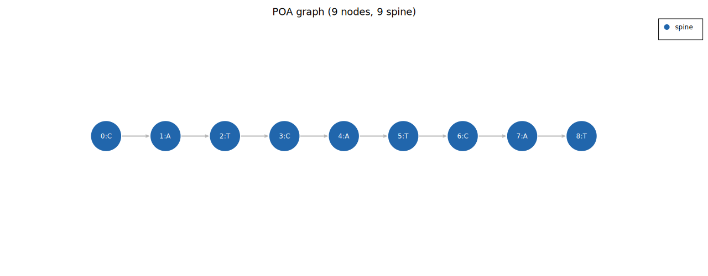
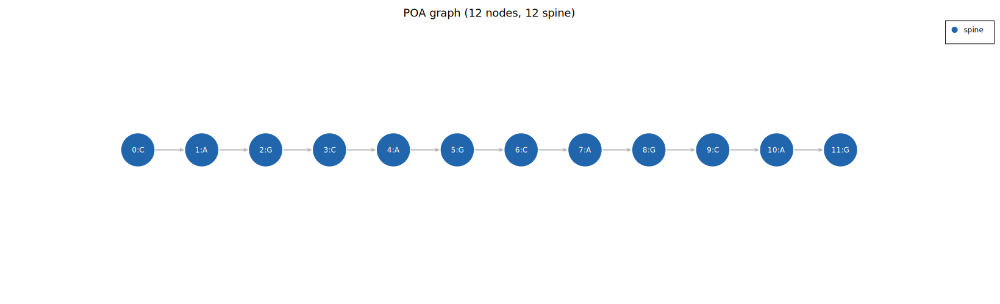
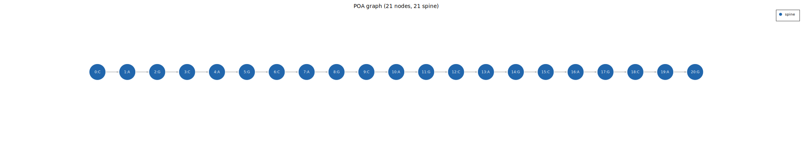
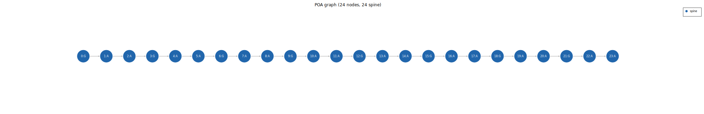
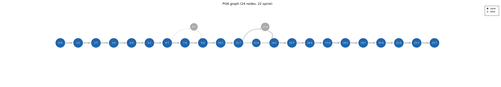
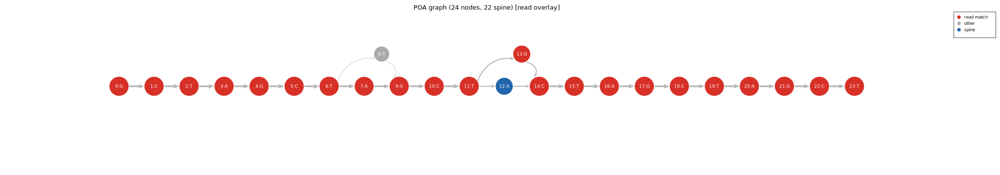
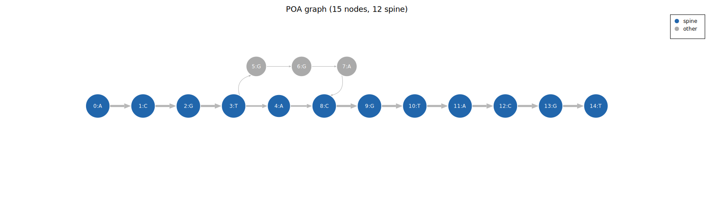
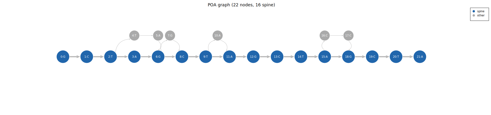
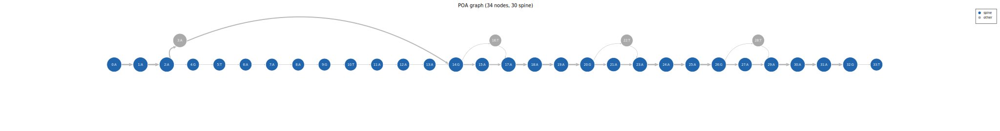

# Visualisation

The `plot` feature provides SVG helpers for inspecting graph structure and alignment
behaviour. All functions return a `String` containing a self-contained SVG.

## Enabling the feature

```toml
[dependencies]
poa-consensus = { version = "0.1", features = ["plot"] }
```

## Graph network

The network plot shows the POA graph topology: spine nodes laid out horizontally, arm
(insert) nodes above or below their attachment points, labels inside nodes.

```rust
use poa_consensus::plot::graph_network_svg;

// Basic graph (spine highlighted in blue)
let svg = graph_network_svg(&graph, None);
std::fs::write("/tmp/graph.svg", &svg)?;

// Overlay a specific read's alignment path (highlighted in orange)
let probe = b"CATCATCAT";
let svg   = graph_network_svg(&graph, Some(probe));
std::fs::write("/tmp/graph_overlay.svg", &svg)?;
```

Edges between spine nodes and arm nodes are drawn as curves so they don't obscure the
spine. The overlay uses a distinct colour to show which nodes a specific read traverses,
useful for debugging alignment of an outlier read.

## Coverage plot

```rust
use poa_consensus::plot::coverage_svg;

let svg = coverage_svg(&result);
std::fs::write("/tmp/coverage.svg", &svg)?;
```

Per-position read depth along the consensus sequence as a line chart. Coverage drops at
gaps or partial-read boundaries are clearly visible.

## Graph statistics

```rust
use poa_consensus::plot::graph_stats_svg;

let svg = graph_stats_svg(&result.graph_stats);
std::fs::write("/tmp/stats.svg", &svg)?;
```

Two-panel bar chart: count statistics on the left (bubble count, node count, edge count),
rate statistics on the right (single-support fraction, edge weight Gini).

## Edge weight histogram

```rust
use poa_consensus::plot::edge_weight_histogram_svg;

let svg = edge_weight_histogram_svg(&graph);
```

Distribution of edge weights across the full graph. A clean single-allele graph has a spike
at the read depth (all spine edges) and a smaller spike at 1 (noise edges). A bimodal
distribution at two different depths suggests two alleles.

## Node coverage histogram

```rust
use poa_consensus::plot::node_coverage_histogram_svg;

let svg = node_coverage_histogram_svg(&graph);
```

Distribution of per-node coverage. Similar interpretation to the edge weight histogram but
counts Match ops rather than traversals.

## Alignment density heatmap

```rust
use poa_consensus::plot::alignment_density_svg;

let svg = alignment_density_svg(&graph);
```

2D histogram of (graph_rank, read_position) alignment density across all reads. The density
should be concentrated along the main diagonal. Off-diagonal density indicates reads that
align to the wrong part of the graph (band too narrow, phase shift, or genuine SV).

## Band with reads overlay

```rust
use poa_consensus::plot::band_with_reads_svg;

let svg = band_with_reads_svg(&graph);
```

Shows the DP band corridor for each read, with per-read alignment paths drawn on top.
Out-of-band segments are shown in red with a connection line to the nearest in-band segment.
Useful for diagnosing `BandTooNarrow` errors or band-width tuning.

## Labeled edge weights

```rust
use poa_consensus::plot::graph_network_svg_labeled;

let svg = graph_network_svg_labeled(&graph, None);
std::fs::write("/tmp/graph_labeled.svg", &svg)?;
```

Same as the network diagram but every edge is labeled with its read count (edge weight).
Useful for understanding the heaviest-path DP, verifying alignment quality, or explaining
boundary trim: low-weight edges at the graph boundaries identify nodes that will be trimmed.

## Running the example

```
cargo run --example network_plot --features plot
```

Writes SVG files to `/tmp/` and `docs/src/diagrams/`:

**Linear consensus** (`poa_linear.svg`): 5 identical reads, 9-node chain, no variants.



**Heaviest-path edge labels** (`poa_heaviest_path.svg`): 9 reads + 1 with a mismatch.
Edge weights are labeled; the single-read arm scores 0 after normalisation and is ignored.


**Boundary trim edge labels** (`poa_boundary_trim.svg`): 3 full-span reads + 7 interior-only
reads. Flank edges (weight 3) fall below min_cov and are boundary-trimmed.


**CAG normal allele** (`poa_cag_normal.svg`): (CAG)×4 = 12-node linear chain.



**CAG expanded allele** (`poa_cag_expanded.svg`): (CAG)×7 = 21-node linear chain (+3 units).



**GAA normal allele** (`poa_gaa_normal.svg`): (GAA)×4 = 12-node linear chain.


**GAA expanded allele** (`poa_gaa_expanded.svg`): (GAA)×8 = 24-node linear chain (+4 units).



**Two-allele SNV graph** (`poa_network.svg`): spine in blue, second allele arm in grey.



**Allele-B read overlaid** (`poa_network_with_read.svg`): the read's path through the graph
is shown in orange (match) and yellow (delete).



**Large 2-base insertion bubble** (`poa_large_bubble.svg`): 15 reference reads plus 5 reads
with a 2-base GG insertion at position 4. The insertion arm has 2 nodes (GG) and is covered
by 5 reads. The direct spine edge (weight 15, score 14) beats the 3-edge arm path (weight 5,
score 12), so the reference stays as the spine and the arm stays grey. min_cov = 10; arm
coverage 5 is below the threshold.



**Noisy single-allele graph** (`poa_network_noisy.svg`): 6 clean reads plus 4 reads each
with a single insertion error at a different position. Four grey arms are scattered across
the spine: three 1-node arms (at positions 1, 4, and 7) and one 2-node CC arm at position
11. Each arm has coverage 1, far below min_cov = 5. The `(weight - 1)` normalisation gives
all arm edges a score of 0, keeping the consensus entirely on the spine.



**RFC1-style mixed allele** (`poa_rfc1_mixed.svg`): 15 reads of (AAAAG)×4 plus 5 reads of
(AAAGT)×6. The normal and pathogenic motifs differ by 2 substitutions per 5-mer; these align
via mismatch rather than creating bubble arms. After the shared 20-position region, the 5
pathogenic reads still have 10 bases (2 extra AAAGT units) which extend the spine as 10
Insert nodes. The first 20 nodes carry full depth (all 20 reads); the last 10 carry only 5.
The smaller node sizes at the right show the coverage drop below min_cov = 10. The heaviest
path extends through the expansion because accumulated edge score beats early termination.
In a real two-allele sample this is why `consensus_multi` (with structural phasing) is
needed: the single-graph heaviest path gives only the expanded-allele length.



**Deletion graph** (`poa_network_deletion.svg`): 10 reads span the full sequence; 3 reads
have a 2-base deletion. The deletion reads traverse a skip arc edge from position 13 to
position 15, bypassing the two deleted nodes.


**Deletion read overlay** (`poa_network_deletion_overlay.svg`): the deleting read (orange)
is shown traversing the skip arc.


